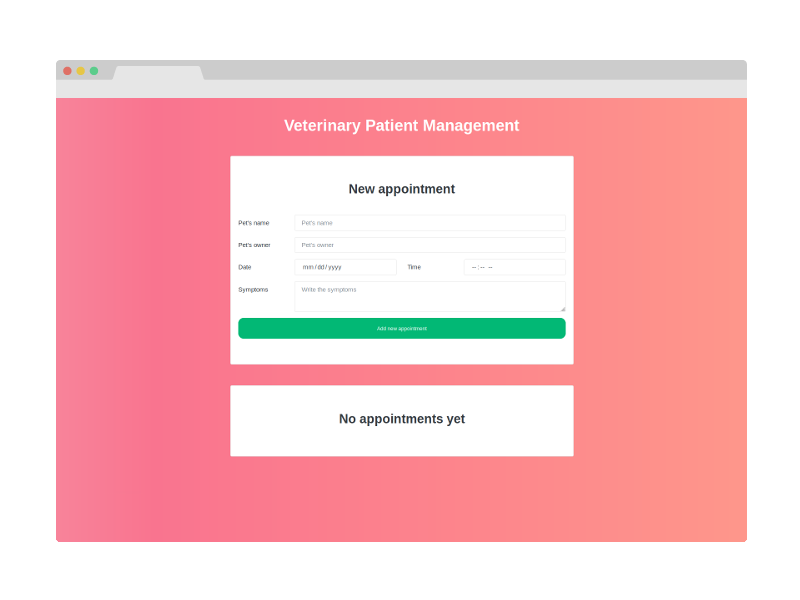

<div align="center">

# Veterinary patients

[Getting Started](#getting-started) | [Prerequisites](#prerequisites) | [Installation](#installation) | [Built With](#built-with)

</div>

<div align="center">
  
</div>

## Getting Started

Appointment management with Class and Stateless Functional Components.

### Prerequisites

Install the [ESLint](https://github.com/Microsoft/vscode-eslint) extension if you use Visual Studio Code.

### Installation

**Step 1:** Clone or download the repo.

**Step 2:** Switch to your repository's directory.

```
cd /path/to/your/repo
```

**Step 3:** Install dependencies.

```
yarn install
```

**Step 4:** Run the server.

```
yarn start
```

## Built With

- [React](https://reactjs.org/) - A JavaScript library for building user interfaces.
- [Bootswatch](https://bootswatch.com/) - Free themes for Bootstrap.

Made with ❤ by bryandms.
